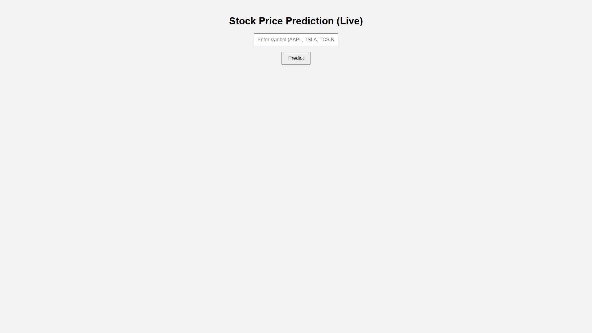
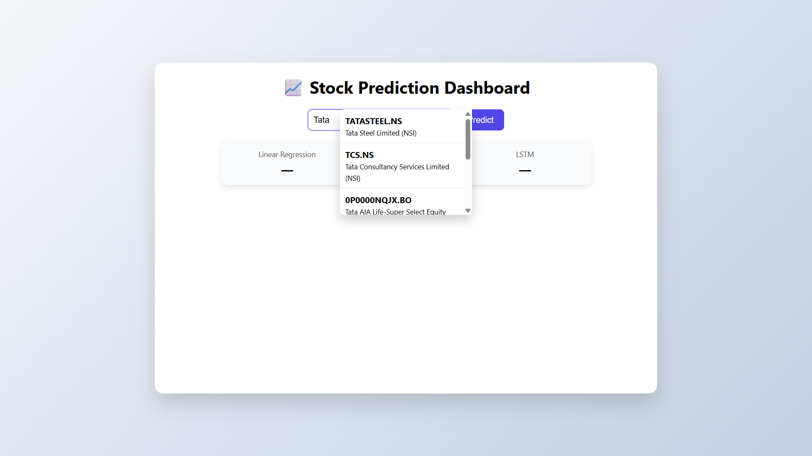
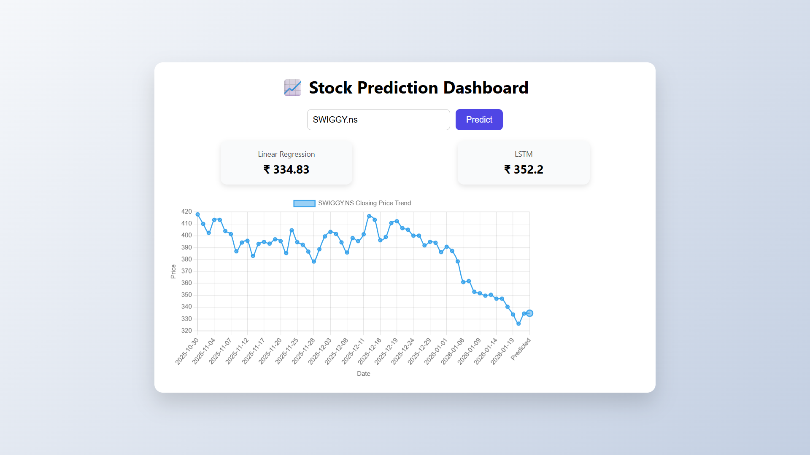

# Live Stock Price Prediction
### Linear Regression & LSTM with Real-Time Data

[](https://www.python.org/)
[](https://flask.palletsprojects.com/)
[](https://www.tensorflow.org/)
[](LICENSE)

A modern machine learning web application that forecasts **next-day stock closing prices** using real-time market data. Built on a Flask backend, this project compares a traditional **Linear Regression** model with a deep learning **Long Short-Term Memory (LSTM)** network to provide interpretable and data-driven market insights across global exchanges.

---

## 🧰 Tech Stack

- **Backend**: Flask (Python)
- **Frontend**: HTML, CSS, JavaScript
- **Visualization**: Chart.js
- **Machine Learning**: Scikit-learn, TensorFlow / Keras
- **Market Data**: Yahoo Finance API (`yfinance` + search endpoint)

---

## 🚀 Feature Highlights

- **Real-Time Data Ingestion**: Live historical and current market data via Yahoo Finance.
- **Dual-Model Inference**: Side-by-side comparison of Linear Regression and LSTM predictions.
- **Global Market Support**: Works with international exchanges (NSE, BSE, NASDAQ, NYSE, LSE, TSX, and more).
- **Interactive Dashboard**: Clean, responsive UI with dynamic price charts and highlighted predictions.
- **Smart Stock Search**: Auto-suggest search with click-to-select symbol resolution.
- **Automated Preprocessing**: On-the-fly data cleaning, normalization, and time-series window generation.

---

## 📂 Folder Structure

```text
stock-prediction/
├── backend/
│   ├── app.py              # Flask application entry point
│   ├── model_lr.py         # Linear Regression training script
│   ├── model_lstm.py       # LSTM training script
│   ├── evaluate_models.py # Model evaluation (MAE / RMSE)
│   ├── templates/
│   │   └── index.html      # Frontend UI
│   └── static/
│       ├── script.js       # Client-side logic
│       └── style.css       # Styling
├── saved_models/
│   ├── linear_model.pkl   # Trained Linear Regression model
│   └── lstm_model.h5     # Trained LSTM model
├── data/
│   └── stock_data.csv    # Optional local dataset
├── requirements.txt
└── README.md
```

---

## 🏗️ System Architecture

```text
User
 ↓
Web UI (HTML / CSS / JavaScript)
 ↓
Flask Backend (REST API)
 ↓
Yahoo Finance (Live Market Data)
 ↓
ML Models (Linear Regression + LSTM)
 ↓
Prediction + Visualization (Chart.js)
```

---

## 🔌 API Endpoints

### 🔍 Search Stock Symbols

```http
GET /search?q=<query>
```

**Description:** Returns a list of matching stock symbols and company names based on the user’s search query.

**Example:**

```http
GET /search?q=tata
```

**Response:**

```json
[
  {
    "symbol": "TCS.NS",
    "name": "Tata Consultancy Services Limited",
    "exchange": "NSI"
  },
  {
    "symbol": "TATASTEEL.NS",
    "name": "Tata Steel Limited",
    "exchange": "NSI"
  }
]
```

---

### 📈 Get Stock Prediction

```http
GET /predict/<symbol>
```

**Description:** Fetches recent historical market data, runs both the Linear Regression and LSTM models, and returns the predicted **next trading day closing price** along with recent price history.

**Example:**

```http
GET /predict/AAPL
```

**Response:**

```json
{
  "symbol": "AAPL",
  "currency": "USD",
  "linear_prediction": 246.83,
  "lstm_prediction": 253.28,
  "history": [241.15, 242.60, 243.10, 244.75, 245.90],
  "dates": ["2026-01-15", "2026-01-16", "2026-01-17", "2026-01-20", "2026-01-21"]
}
```

---

## 🛠️ Installation & Setup

### 1. Clone the Repository

```bash
git clone https://github.com/yourusername/stock-prediction.git
cd stock-prediction
```

### 2. Create Virtual Environment

```bash
# Windows
python -m venv venv
venv\Scripts\activate

# macOS/Linux
python3 -m venv venv
source venv/bin/activate
```

### 3. Install Dependencies

```bash
pip install -r requirements.txt
```

---

## 🧠 Model Training

Before running the application, train the models to generate the required `.pkl` and `.h5` model files.

```bash
# Train Linear Regression Model
python backend/model_lr.py

# Train LSTM Model
python backend/model_lstm.py
```

> **Note:** Training time depends on dataset size and system performance.

---

## ▶️ Running the Application

Start the Flask server:

```bash
python backend/app.py
```

Access the application at:

```
http://127.0.0.1:5000
```

---

## 🖼️ Screenshots

<div align="center">

### Dashboard Interface



### Smart Stock Search



### Prediction Output



</div>

---

## 🌍 Smart Symbol Entry

Users can:
- **Type a company name** (e.g., `tata`, `tesla`, `apple`)
- Or manually enter a valid Yahoo Finance ticker

### Market Suffix Reference

| Country | Market | Suffix | Example |
| :--- | :--- | :--- | :--- |
| **USA** | NASDAQ / NYSE | *None* | `AAPL`, `TSLA` |
| **India** | NSE | `.NS` | `RELIANCE.NS` |
| **India** | BSE | `.BO` | `TCS.BO` |
| **UK** | LSE | `.L` | `BARC.L` |
| **Canada** | TSX | `.TO` | `SHOP.TO` |

---

## 📊 What the Prediction Means

- **Prediction Target**: Closing price for the **next trading day**
- **Linear Regression**: Baseline statistical trend
- **LSTM**: Deep learning sequence-based prediction

> If `Predicted Price > Recent Price`, the short-term trend may be interpreted as **bullish**. If lower, it may indicate a **bearish** trend.

---

## 🤖 Models Used

### 1. Linear Regression
- **Type**: Statistical
- **Strengths**: Fast, interpretable, strong baseline
- **Limitations**: Assumes linear trends

### 2. Long Short-Term Memory (LSTM)
- **Type**: Recurrent Neural Network
- **Strengths**: Learns temporal dependencies and non-linear patterns
- **Limitations**: Higher computational cost, sensitive to training data

---

## 📈 Model Evaluation

Both models are evaluated using standard regression metrics on a held-out test set:

- **MAE (Mean Absolute Error)**
- **RMSE (Root Mean Square Error)**

Run evaluation:

```bash
python backend/evaluate_models.py
```

### Sample Output

```text
Linear Regression:
MAE  : 2.40
RMSE : 3.47

LSTM:
MAE  : 6.04
RMSE : 7.88
```

> Results vary depending on dataset, time window, and market volatility.

---

## ☁️ Deployment Notes

This project is optimized for **local deployment** due to deep learning runtime and memory constraints on most free-tier cloud platforms.

Optional deployment paths:
- Hugging Face Spaces (Gradio-based interface)
- Docker (Python 3.11 base image recommended)

> TensorFlow model compatibility depends on strict version alignment between training and runtime environments.

---

## ⚠️ Disclaimer

This project is intended for **educational and research purposes only**. It does not constitute financial advice. Market prices are volatile and influenced by external, unpredictable factors.

---

## 👨‍💻 Author

**Aman Agarwal**

